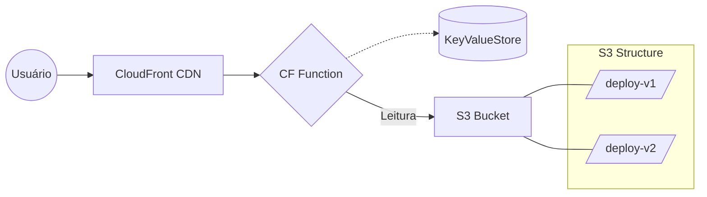

import { Button } from "@/components/ui/button";

Manter uma aplicação em alta disponibilidade durante o deploy sempre foi um desafio. Mesmo com sites estáticos, o tempo entre o upload de novos arquivos e a invalidação de cache pode gerar momentos onde um usuário baixa um HTML novo que aponta para um CSS antigo (hash mismatch), quebrando o layout.

A solução? **Blue-Green Deployment Atômico**.

Neste guia, vou abrir a caixa preta da arquitetura que uso para garantir que meus sites (e de meus clientes) tenham **uptime de 100% durante deploys**, com rollbacks instantâneos.

## A Arquitetura

Esqueça a ideia de sobrescrever arquivos no mesmo bucket. O segredo é a **imutabilidade**.

<br />



<br />

1.  **Imutabilidade**: Cada deploy cria uma nova pasta no S3 (ex: `/deploy-a1b2c3d/`). Nada é deletado ou sobrescrito.
2.  **Roteamento Inteligente**: Uma **CloudFront Function** intercepta cada requisição _antes_ de chegar ao cache.
3.  **Estado Global**: O **CloudFront KeyValueStore** guarda apenas um ponteiro: "Qual é a versão atual?".

## Passo 1: O Workflow de CI/CD (GitHub Actions)

O coração da automação está no GitHub Actions. Não queremos apenas "subir arquivos", queremos orquestrar uma mudança de estado.

```yaml
# .github/workflows/deploy.yml
name: Deploy Production

on:
  push:
    branches: [main]

jobs:
  deploy:
    runs-on: ubuntu-latest
    steps:
      - uses: actions/checkout@v4

      - name: Build Astro
        run: npm ci && npm run build

      - name: Configure AWS Credentials
        uses: aws-actions/configure-aws-credentials@v4
        with:
          aws-access-key-id: ${{ secrets.AWS_ACCESS_KEY_ID }}
          aws-secret-access-key: ${{ secrets.AWS_SECRET_ACCESS_KEY }}
          aws-region: us-east-1

      # 1. Upload para uma pasta nova e única (Hash do Commit)
      - name: Sync to S3 (New Version)
        run: |
          aws s3 sync ./dist s3://${{ secrets.S3_BUCKET }}/deploy-${{ github.sha }} \
            --delete --cache-control "max-age=31536000,immutable"

      # 2. Atualizar o KeyValueStore para apontar para a nova versão
      - name: Update CloudFront KVS
        run: |
          aws cloudfront-keyvaluestore put-key \
            --kvs-arn ${{ secrets.KVS_ARN }} \
            --if-match-key-value ${{ secrets.CURRENT_VERSION }} \
            --key "current_release" \
            --value "deploy-${{ github.sha }}"
```

> **Nota Pro**: O `--cache-control "max-age=31536000,immutable"` é seguro aqui porque os arquivos nunca mudam de nome. Cada deploy tem sua própria URL única internamente.

## Passo 2: A CloudFront Function (O Cérebro)

Aqui é onde a mágica acontece. Usamos o runtime `cloudfront-js-2.0` para ler do KeyValueStore com latência de milissegundos.

```javascript
import cf from "cloudfront";

const kvsId = "seu-kvs-id-aqui";
const kvsHandle = cf.kvs(kvsId);

async function handler(event) {
  const request = event.request;

  try {
    // Busca qual a pasta "ativa" no momento
    const currentVersion = await kvsHandle.get("current_release");

    // Reescreve a URI para apontar para a pasta correta no S3
    // A URL pública continua sendo /sobre, mas internamente vira /deploy-abc123/sobre/index.html
    request.uri = `/${currentVersion}${request.uri}`;
  } catch (err) {
    // Fallback de segurança (opcional)
    console.log(`KVS Read Error: ${err}`);
  }

  return request;
}
```

## Passo 3: Rollback Instantâneo

Deploy quebrou? Esqueça `git revert` e esperar o build rodar de novo.

Como a versão antiga ainda está no S3 (lembra da imutabilidade?), basta mudar o ponteiro no KVS de volta para o hash anterior.

```bash
# Comando de Pânico (Rollback)
aws cloudfront-keyvaluestore put-key \
    --kvs-arn arn:aws:cloudfront::... \
    --key "current_release" \
    --value "deploy-versao-anterior"
```

Tempo total de recuperação: **< 2 segundos**.

## Por que não apenas Invalidar o Cache?

Invalidar o CloudFront (`/*`) custa dinheiro e demora (às vezes minutos) para propagar globalmente. Além disso, derruba a performance do seu site pois o cache precisa ser reconstruído do zero.

Com essa estratégia de **Blue-Green**, o cache da versão antiga fica lá até expirar naturalmente, e o cache da nova versão começa "fresco". A transição é imediata para todos os usuários globais assim que o KVS é atualizado.

## Conclusão

Essa arquitetura eleva o nível técnico do seu projeto. Ela desacopla o tempo de build do tempo de release, permitindo testes A/B (você poderia mandar 10% dos usuários para a versão nova mudando a lógica da Function) e garantindo uma estabilidade absoluta.

Pronto para implementar no seu próximo projeto?

<a
  href="https://docs.aws.amazon.com/AmazonCloudFront/latest/DeveloperGuide/kvs-with-functions.html"
  target="_blank"
  rel="noopener noreferrer"
  class="inline-flex items-center justify-center gap-2 rounded-md bg-blue-600 px-6 py-3 text-sm font-medium !text-white shadow hover:bg-blue-700 transition-colors no-underline !mb-0"
>
  Docs Oficiais do CloudFront KVS
</a>
